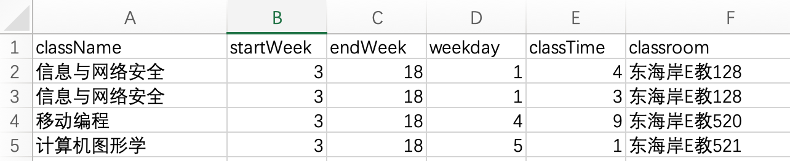
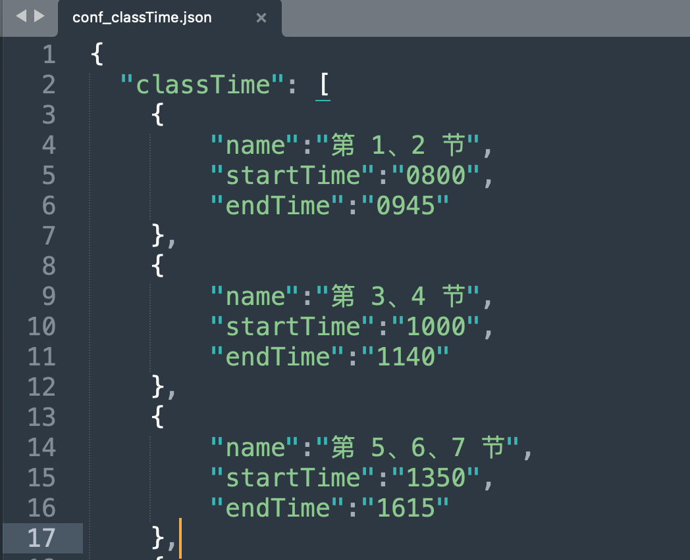
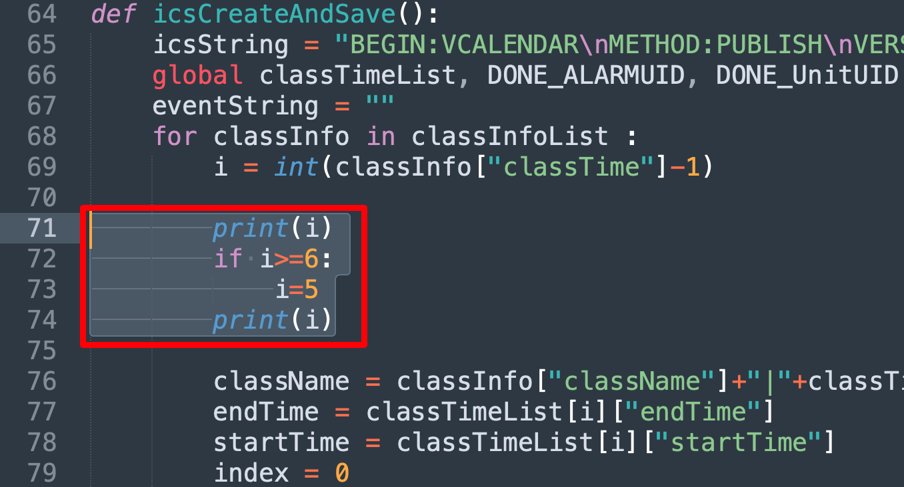

# 自动导入课表python

‍

足足花了我4个hour

写在前面：参考文章https://sspai.com/post/39645

抱怨： oh my god 这篇文章也太老了，用的python文件的版本大概是2.7 ，所以每次reload会报错，现在我真实的体验到python版本迭代，部分包无法使用，对象特性不同。还有就是读取csv文件的代码，总是出错！！要用openpyxl ，我也不知道为啥用这个读取，然后读取后我的data格式有变化， 跟之前用xlrf读取的对象不一样。

原code使用.cell( ).value获取：

​`classNameList.append(((table.cell(i, _colOfClassName).value)))`​

改正后为使用.at[ ] 获取行和列：

​`table.at[i, _colOfClassName] ​`​

原 `​ raw_input`​ ---> 要改成 `input( )`​

‍

‍

# <u>这也太不自动了</u>

   ----你好坏啊! 以后查看我的学习笔记需要付一个小 ㊎ 币

‍

**1.1** **使用步骤：**

**Step1 ​**将自己的课表写入classinfo.xlsx里面

[classInfo.xlsx](assets/classInfo-20231013115956-8v6d6iq.xlsx)

​​

ps： 我记得这个地方-似乎是从第3行开始读，不知道为啥，也就是你的第一个课程信息，这个脚本会记录不到，导致你需要再多写一行

‍

**Step2 ​** 配置conf_classtime.json

[conf_classTime.json](assets/conf_classTime-20231013120608-idulvrq.json)



‍

**Step3 ​** 使用excelReader.py (python == 3.11)

[excelReader.py](assets/excelReader-20231013120702-edih9cz.py)

只要不报错，就可以进入下一步

‍

**Step4 ​** 使用main.py (python == 3.11)

[main.py](assets/main-20231013121550-t086dqm.py)



‍

**Ps : ​**如果出现 i 超越数组的bug 就改这里， 只要出现课表的节数错误，比如原来是6 7，变成了8 9 ， 就该这个判断条件，我不知道为啥要这样改，应该是原作者把这个设定为了大课程时间，反正我没看懂，改就对了

‍

‍

**Pb1: ​**

```js
Traceback (most recent call last):
    File "(stdin)", line 1, in (module)
    ...
NameError: name 'reload' is not defined
```

> **​ Ways:**
>
> ***For &gt;= Python3.4:***
>
> ```
> import importlib
> importlib.reload(module)
> ```
>
> ***For &lt;= Python3.3:***
>
> ```
> import imp
> imp.reload(module)
> ```
>
> ***For Python2.x:***
>
> Use the in-built** **`reload()`​ function.
>
> ```
> reload(module)
> ```
>
> ‍

‍

‍
